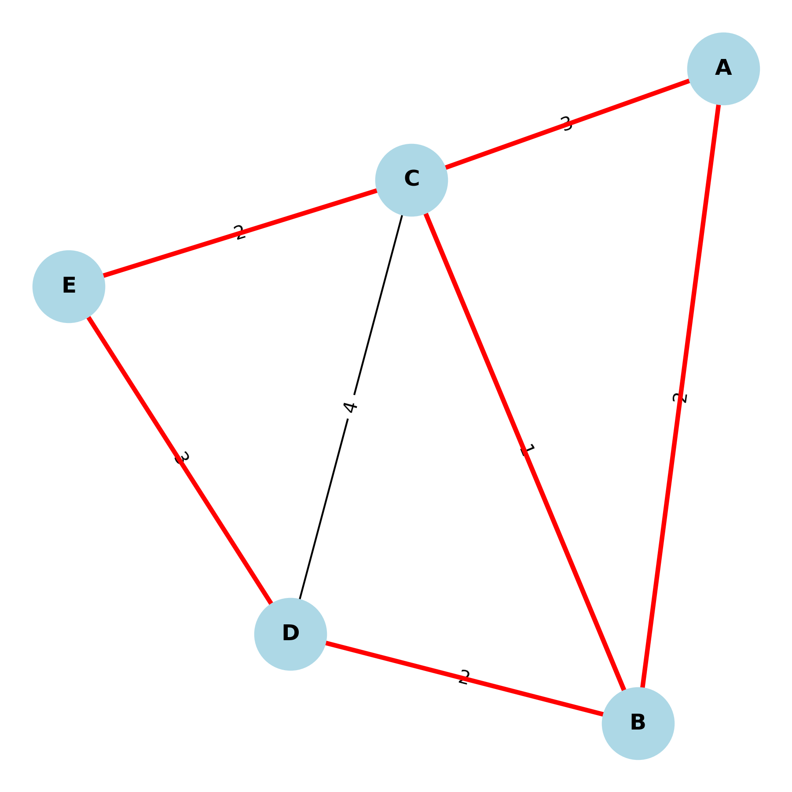

# Seminário — Problema do Carteiro Chinês (PCC)

Repositório do seminário da disciplina PAA/UFS sobre o Problema do Carteiro Chinês (CPP) em grafos não dirigidos. Traz implementação em Python, dados de exemplo, conversor GeoJSON→CSV, testes e slides.

---

Try it (rápido)

- Quer ver funcionando em 1 minuto? Vá direto para o [Quickstart](#quickstart).

---

## Objetivos

- Contextualizar o problema e aplicações (coleta de lixo, varrição, leitura de medidores etc.).
- Explicar a solução ótima para grafos não dirigidos (eulerização via matching mínimo + circuito de Euler).
- Disponibilizar uma CLI reprodutível, dados e slides para demonstração.

---

## Estrutura do repositório

```text
.
├── src/
│   └── pcc/
│       ├── __init__.py
│       ├── chinese_postman.py      # algoritmo CPP (não dirigido)
│       ├── graph_io.py             # leitura de CSV u,v,w
│       └── solve_cli.py            # CLI (execução e plot)
├── data/
│   ├── example_edges.csv           # instância didática
│   └── osm_subgraph.geojson        # (opcional) subgrafo OSM
├── tools/
│   └── geojson_to_csv.py           # GeoJSON → CSV u,v,w (leve)
├── tests/
│   └── test_example.py             # teste mínimo
├── slides/
│   ├── seminario.md                # slides (Marp)
│   └── seminario.pdf               # exportado
├── requirements.txt                # networkx, matplotlib, pytest
├── Makefile                        # atalhos (Unix/Git Bash)
├── make.ps1                        # atalhos (Windows/PowerShell)
└── README.md
```

---

## Pré‑requisitos

- Python 3.10+ (recomendado 3.11/3.12)
- (Opcional) Node.js para exportar slides com Marp

---

## Quickstart

Windows (PowerShell)

```powershell
python -m venv .venv
. .\.venv\Scripts\Activate.ps1
pip install -r requirements.txt
$env:PYTHONPATH="src"
python -m pcc.solve_cli --input data\example_edges.csv --plot --save-plot out\example.png --save-tour out\example_tour.txt
```

Se o PowerShell não propagar `PYTHONPATH`, use o cmd como alternativa:

```powershell
cmd /d /c "set PYTHONPATH=src&& python -m pcc.solve_cli --input data\example_edges.csv"
```

Linux/macOS

```bash
python3 -m venv .venv
source .venv/bin/activate
pip install -r requirements.txt
PYTHONPATH=src python -m pcc.solve_cli --input data/example_edges.csv --plot --save-plot out/example.png --save-tour out/example_tour.txt
```

Windows (com make.ps1)

```powershell
.\make.ps1 install
.\make.ps1 run
.\make.ps1 plot   # gera e salva a figura em out\example.png
.\make.ps1 real
.\make.ps1 test
```

---

## Instalação

Windows (PowerShell)

```powershell
python -m venv .venv
. .\.venv\Scripts\Activate.ps1
pip install -r requirements.txt
```

Linux/macOS

```bash
python3 -m venv .venv
source .venv/bin/activate
pip install -r requirements.txt
```

---

## Executar o exemplo (didático)

CSV de exemplo (data/example_edges.csv):

```csv
u,v,w
A,B,2
A,C,3
B,C,1
B,D,4
C,E,2
D,E,3
```

Nota sobre pesos (w)

- A coluna `w` representa o custo da aresta e deve ser não negativa.
- Se você usar o conversor `tools/geojson_to_csv.py`, `w` será a distância geodésica em metros.
- Você pode usar outras unidades (km, tempo, custo monetário); apenas mantenha a unidade consistente — o algoritmo minimiza a soma dos pesos.

Windows (PowerShell)

```powershell
$env:PYTHONPATH="src"
python -m pcc.solve_cli --input data\example_edges.csv
python -m pcc.solve_cli --input data\example_edges.csv --plot --save-plot out\example.png --save-tour out\example_tour.txt
```

Alternativa (evita escopo de variável no PowerShell):

```powershell
cmd /d /c "set PYTHONPATH=src&& python -m pcc.solve_cli --input data\example_edges.csv --plot --save-plot out\example.png --save-tour out\example_tour.txt"
```

Linux/macOS

```bash
PYTHONPATH=src python -m pcc.solve_cli --input data/example_edges.csv
PYTHONPATH=src python -m pcc.solve_cli --input data/example_edges.csv --plot --save-plot out/example.png --save-tour out/example_tour.txt
```

Flags da CLI

- `--input` (alias: `--edgelist`): caminho do CSV `u,v,w`.
- `--plot` (alias: `--draw`): exibe/gera figura com arestas duplicadas.
- `--save-plot PATH`: salva a figura (PNG/SVG).
- `--save-tour PATH`: salva o tour (sequência de vértices) em texto.
- `--largest-component`: usa apenas o maior componente conexo (útil em dados reais desconexos).

Saída esperada (o tour pode variar):

```
Total cost: 16.0
Tour: A -> C -> E -> D -> B -> C -> B -> A
```

---

## Como o algoritmo funciona (resumo)

1) Verifica conectividade (ignorando isolados) e soma o custo base.
2) Lista vértices de grau ímpar. Se não houver, extrai circuito de Euler.
3) Calcula caminhos mínimos entre ímpares (Dijkstra).
4) Emparelhamento perfeito mínimo (DP por bitmask; O(k^2·2^k)).
5) Duplica arestas dos caminhos escolhidos e extrai circuito euleriano no multigrafo.
6) Método é ótimo para grafos não dirigidos com pesos ≥ 0.

Arquivos: `src/pcc/chinese_postman.py` (solver), `src/pcc/solve_cli.py` (CLI/plot), `src/pcc/graph_io.py` (CSV).

---

## Estudo de caso real (OSM)

1) Converter GeoJSON → CSV `u,v,w` (ajuste a junção de nós com `--snap-m`, em metros):
  - Observação: `tools/geojson_to_csv.py` usa apenas a biblioteca padrão do Python (sem dependências extras).

Windows (PowerShell)

```powershell
python tools\geojson_to_csv.py data\osm_subgraph.geojson data\real_edges.csv --snap-m 8
```

Linux/macOS

```bash
python tools/geojson_to_csv.py data/osm_subgraph.geojson data/real_edges.csv --snap-m 8
```

2) Resolver restringindo ao maior componente e salvar artefatos para os slides:

Windows (PowerShell)

```powershell
$env:PYTHONPATH="src"
python -m pcc.solve_cli --input data\real_edges.csv --largest-component --plot --save-plot out\real_solution.png --save-tour out\real_tour.txt
```

Linux/macOS

```bash
PYTHONPATH=src python -m pcc.solve_cli --input data/real_edges.csv --largest-component --plot --save-plot out/real_solution.png --save-tour out/real_tour.txt
```

Inclua a figura e o custo nos slides (com o crédito do OSM).

---

## Compatibilidade/aliases da CLI

Os aliases abaixo são equivalentes às flags principais e existem por conveniência.

Windows (PowerShell)

```powershell
$env:PYTHONPATH="src"
# --input ≡ --edgelist
python -m pcc.solve_cli --edgelist data\example_edges.csv
# --plot ≡ --draw
python -m pcc.solve_cli --input data\example_edges.csv --draw --save-plot out\example.png
```

Linux/macOS

```bash
PYTHONPATH=src python -m pcc.solve_cli --edgelist data/example_edges.csv
PYTHONPATH=src python -m pcc.solve_cli --input data/example_edges.csv --draw --save-plot out/example.png
```

---

## Testes

```bash
pytest -q
```

O teste `tests/test_example.py` confere custo ≈ 16.0, tour fechado e cobertura das arestas do exemplo.

---

## Slides (Marp)

```bash
npx @marp-team/marp-cli slides/seminario.md -o slides/seminario.pdf
```

---

## Dicas e troubleshooting

- `ModuleNotFoundError: pcc`: defina `PYTHONPATH=src` como nos comandos acima.
- Grafo real desconexo: use `--largest-component` ou aumente `--snap-m` no conversor.
- Sem `make` no Windows: use os comandos PowerShell ou crie um `make.ps1` com atalhos.
- Ambiente sem GUI (servidor/CI): gere apenas arquivo com `--save-plot out/fig.png` (omita `--plot`) para não abrir janela gráfica.

---

## Exemplo ilustrativo

Abaixo está um exemplo gráfico do **Problema do Carteiro Chinês** aplicado a um grafo simplificado (um “bairro” com 5 esquinas A–E).

- Vértices representam esquinas.
- Arestas representam ruas, com pesos equivalentes a distâncias.
- O caminho ótimo encontrado pelo algoritmo está destacado em **vermelho**.



---

## Créditos e licenças

- Código: pode ser licenciado como MIT (adicione um `LICENSE` se desejar).
- Dados: “Map data © OpenStreetMap contributors”, ODbL 1.0.
  - https://www.openstreetmap.org/copyright
  - https://osmfoundation.org/wiki/Licence/Attribution_Guidelines
  - https://opendatacommons.org/licenses/odbl/1-0/

---

## Autores

- Gilson Inácio da Silva
- Ederson Manoel de Oliveira
